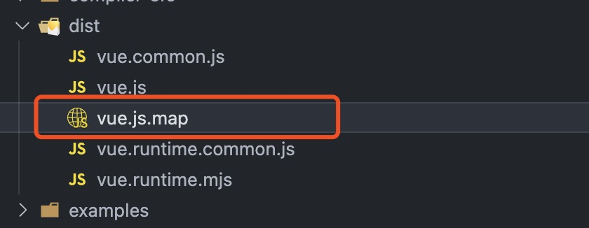

上面说要开始学习 Vue 源码，首先得先拿到源码，然后能在源码里进行调试，知道哪些 api 是在哪儿使用的，知道走了哪些地方。所以，需要先构建一个能调试的环境。

## 获取 Vue 源码

从 Vue 官方的 repo 里 clone 一份代码

```bash
git clone https://github.com/vuejs/vue.git
```

## 安装依赖

进入到 Vue 的项目中，安装依赖。Vue 2.7.13 的代码已经使用了 pnpm 作为包管理器，所以我们使用 pnpm 来安装 Vue 源码中的依赖。

```bash
pnpm install
```

## 构建 sourceMap 文件

Vue 源码是用 rollup 打包和压缩的，在调试的时候，只能看到打包后的代码，很难调试。所以我们要在调试的时候，使用 sourceMap 文件，有问题也可以很快的定位到。

在 package.json 的 scripts 对象中，给 dev 属性添加一个 `--sourcemap`

```js
"scripts": {
    "dev": "rollup -w -c scripts/config.js --environment TARGET:full-dev --sourcemap",
    ...
}

```

然后运行 `npm run dev` 就可以生成 vue.js.map 文件了

```bash
npm run dev
```



## 创建调试页面

可以在 examples 目录下，创建一个 test 文件夹，在 test 下面再新建一个 index.html 文件  

```html
<html>
    <header>
        <script src="../../dist/vue.js"></script>
    </header>
    <body>
        <div id="app">
          {{message}}
        </div>
        <script>
            new Vue({
                el: '#app',
                data: { message: 'message' }
            })
        </script>
    </body>
</html>
```

其他的就可以在 Chrome 里打开这个 html 文件，就可以开心的调试了～～
