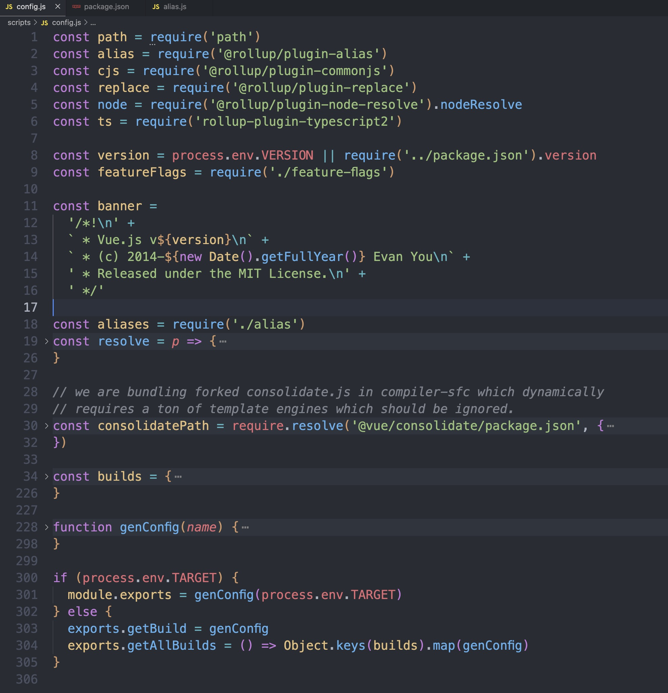
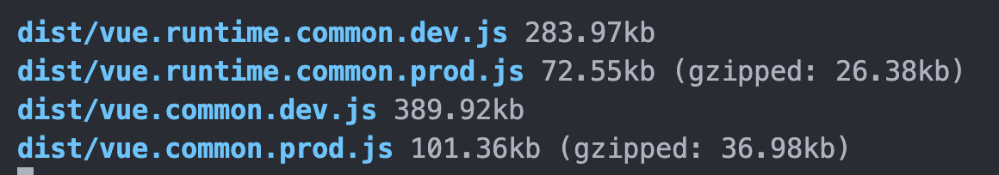

## 开发环境

上面我们运行 `npm run dev` 得到了 Vue 的打包后的代码。我们看一下 package.json/scripts 里 dev 相关的代码

```json
"scripts": {

  "dev": "rollup -w -c scripts/config.js --environment TARGET:full-dev --sourcemap",
  "dev:cjs": "rollup -w -c scripts/config.js --environment TARGET:runtime-cjs-dev",
  "dev:esm": "rollup -w -c scripts/config.js --environment TARGET:runtime-esm",
  "dev:ssr": "rollup -w -c scripts/config.js --environment TARGET:server-renderer",
  "dev:compiler": "rollup -w -c scripts/config.js --environment TARGET:compiler ",
  ...
}
```

Vue 开发环境构建的入口文件是 script/config.js，根据传入的参数不同，来构建不同的环境的代码。

简单看一下 config.js 

config 文件中，主要的内容是，根据命令行参数对构建配置做过滤。判断`process.env.Target` 如果有
Target，就导出`genConfig(process.env.Target)` 这个方法；如果没有就导出`getBuild`和`getAllBuilds`这两个方法。

主要就是 `genConfig` 这个方法：

```js
function genConfig(name) {
  const opts = builds[name];
  const isTargetingBrowser = !(opts.transpile === false || opts.format === 'cjs');

  const config = {
    input: opts.entry,
    external: opts.external,
    plugins: [
      alias({
        entries: Object.assign({}, aliases, opts.alias),
      }),
      ts({
        tsconfig: path.resolve(__dirname, '../', 'tsconfig.json'),
        cacheRoot: path.resolve(__dirname, '../', 'node_modules/.rts2_cache'),
        tsconfigOverride: {
          compilerOptions: {
            // if targeting browser, target es5
            // if targeting node, es2017 means Node 8
            target: isTargetingBrowser ? 'es5' : 'es2017',
          },
          include: isTargetingBrowser ? ['src'] : ['src', 'packages/*/src'],
          exclude: ['test', 'test-dts'],
        },
      }),
    ].concat(opts.plugins || []),
    output: {
      file: opts.dest,
      format: opts.format,
      banner: opts.banner,
      name: opts.moduleName || 'Vue',
      exports: 'auto',
    },
    onwarn: (msg, warn) => {
      if (!/Circular/.test(msg)) {
        warn(msg);
      }
    },
  };

  // built-in vars
  const vars = {
    __VERSION__: version,
    __DEV__: `process.env.NODE_ENV !== 'production'`,
    __TEST__: false,
    __GLOBAL__: opts.format === 'umd' || name.includes('browser'),
  };
  // feature flags
  Object.keys(featureFlags).forEach((key) => {
    vars[`process.env.${key}`] = featureFlags[key];
  });
  // build-specific env
  if (opts.env) {
    vars['process.env.NODE_ENV'] = JSON.stringify(opts.env);
    vars.__DEV__ = opts.env !== 'production';
  }

  vars.preventAssignment = true;
  config.plugins.push(replace(vars));

  Object.defineProperty(config, '_name', {
    enumerable: false,
    value: name,
  });

  return config;
}
```

这个方法是根据入参 `name`，也就是命令行的参数，拿到 `builds` 里的相关设置，返回一个 rollup 构建的配置属性的 `config`

其中 builds 是 Vue 各种环境的打包配置,

```js
const builds = {
  ...
  // Runtime+compiler development build (Browser)
  'full-dev': {
    entry: resolve('web/entry-runtime-with-compiler.ts'),
    dest: resolve('dist/vue.js'),
    format: 'umd',
    env: 'development',
    alias: { he: './entity-decoder' },
    banner
  },
  ...
}

```

上面是运行 `npm run dev` 时，`TARGET = 'full-dev'` 的配置。包括了入口文件，输出地址，构建格式（cjs： CommonJS 规范， es： ES Module 规范。 umd： UMD 规范。），当前的环境，以及别名等。

上面的这个`full-dev` 这个配置，入口是 `resolve('web/entry-runtime-with-compiler.ts')` , 来看一下`resolve` 和 `aliases` 这两个

```js
const aliases = require('./alias');
const resolve = (p) => {
  const base = p.split('/')[0];
  if (aliases[base]) {
    return path.resolve(aliases[base], p.slice(base.length + 1));
  } else {
    return path.resolve(__dirname, '../', p);
  }
};
```

`resolve` 这个方法是来把参数 `p` 根据 ‘/’ 分割成多个参数，根据第一个参数 base，从 `aliases` 里匹配对应的 'path'

```js
const path = require('path');

const resolve = (p) => path.resolve(__dirname, '../', p);

module.exports = {
  vue: resolve('src/platforms/web/entry-runtime-with-compiler'),
  compiler: resolve('src/compiler'),
  core: resolve('src/core'),
  shared: resolve('src/shared'),
  web: resolve('src/platforms/web'),
  server: resolve('packages/server-renderer/src'),
  sfc: resolve('packages/compiler-sfc/src'),
};
```

`aliases` 就是一个 map，dev 环境下，`base` 的值是 `web`,所以对应的入口文件就是
：`src/platforms/web/entry-runtime-with-compiler.ts`

然后构建出来就是在 dist 目录下的 vue.js 了

## 生产环境构建

生产环境相关的命令

```json
"scripts": {
  ...
  "build": "node scripts/build.js",
  "build:ssr": "npm run build -- runtime-cjs,server-renderer",
  "build:types": "rimraf temp && tsc --declaration --emitDeclarationOnly --outDir temp && api-extractor run && api-extractor run -c packages/compiler-sfc/api-extractor.json",
  ...
}
```

生产版本的构建，入口是 scripts/build.js, 我们来看一下 build.js

```js
const fs = require('fs')
const path = require('path')
const zlib = require('zlib') // 提供gzip功能实现压缩
const rollup = require('rollup') // 打包
const terser = require('terser') // 压缩代码。

// 判断是否存在 dist 目录，如果不存在就创建一个 dist 目录
if (!fs.existsSync('dist')) {
  fs.mkdirSync('dist')
}

// 拿到所有 build 键值对对应的数组
let builds = require('./config').getAllBuilds()

// filter builds via command line arg
if (process.argv[2]) {
  const filters = process.argv[2].split(',')
  builds = builds.filter(b => {
    return filters.some(
      f => b.output.file.indexOf(f) > -1 || b._name.indexOf(f) > -1
    )
  })
}

build(builds)

function build(builds) {
  let built = 0
  const total = builds.length
  const next = () => {
    buildEntry(builds[built])
      .then(() => {
        built++
        if (built < total) {
          next()
        }
      })
      .catch(logError)
  }

  next()
}

function buildEntry(config) {
  const output = config.output
  const { file, banner } = output
  const isProd = /(min|prod)\.js$/.test(file)
  // 返回一个 promise
  return rollup
    .rollup(config)
    .then(bundle => bundle.generate(output)) // 解析一个bundle，然后生产code
    .then(async ({ output: [{ code }] }) => {
      // code 是一个对象，文件名为 key， 源码为 value
      // 生产环境会走 terser.minify 压缩
      if (isProd) {
        const { code: minifiedCode } = await terser.minify(code, {
          toplevel: true,
          compress: {
            pure_funcs: ['makeMap']
          },
          format: {
            ascii_only: true
          }
        })
        const minified = (banner ? banner + '\n' : '') + minifiedCode
        return write(file, minified, true)
      } else {
        return write(file, code)
      }
    })
}

// 目标文件 dest，内容 code，开启压缩 zip
function write(dest, code, zip) {
  return new Promise((resolve, reject) => {
    // 在运行时的控制台打印出蓝色的 log 日志，包括文件地址，大小等信息
    function report(extra) {
      console.log(
        blue(path.relative(process.cwd(), dest)) +
          ' ' +
          getSize(code) +
          (extra || '')
      )
      resolve()
    }

    // fs.writeFile 异步地将数据写入文件，如果文件已经存在，则替换该文件
    if (!fs.existsSync(path.dirname(dest))) {
      fs.mkdirSync(path.dirname(dest), { recursive: true })
    }
    fs.writeFile(dest, code, err => {
      if (err) return reject(err)
      if (zip) {
        // 开启gzip压缩
        zlib.gzip(code, (err, zipped) => {
          if (err) return reject(err)
          report(' (gzipped: ' + getSize(zipped) + ')')
        })
      } else {
        report()
      }
    })
  })
}

// 获取文件大小
function getSize(code) {
  return (code.length / 1024).toFixed(2) + 'kb'
}

function logError(e) {
  console.log(e)
}

// 蓝色信息
function blue(str) {
  return '\x1b[1m\x1b[34m' + str + '\x1b[39m\x1b[22m'
}

```

build.js 就主要执行了 `build` 方法，这个方法的主要作用就是遍历所有的配置，把所有的配置都构建出来。`buildEntry` 方法则是真正执行构建的方法，使用 rollup 来把多个配置类型的 Vue 构建出来，rollup的rollup方法会返回一个promise，构建出bundle之后会生成code，如果生产环境会压缩，调用write等方法，写入文件，在控制台打印信息。



## runtime 和 complier

Vue 的构建配置中，有的是 runtime only 有的是 runtime + complier，这又有什么区别呢？

它们区别在于 runtime + compiler 是包含编译过程的，把编译代码放在运行时做。runtime only 需要结合 vue-template-compiler 事先将模版编译成 render 函数再执行
runtime only 运行起来会更快一些。

而 Vue cli 中使用的 runtime only的，因为在构建的时候，会有vue-template-complier来处理相关的模板。
