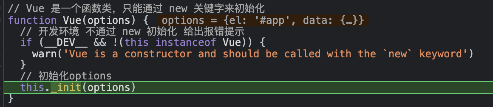

不管我们在使用 Vue Cli 生成的框架，还是直接 script 标签引入的 Vue，在使用 Vue 的时候，都需要 new
Vue(); 原因上一篇已经讲过，Vue 是一个函数类，只能通过 new 来创建一个实例，从而来使用。

这篇我们来看一下 Vue 初始化的过程，我们在第一篇里创建了调试环境，我们就在 new Vue 的时候打一个断点，来看看 Vue 初始化都做了哪些事情。



在 new Vue（） 的时候，进入到了 Vue 的方法里，并执行了`this._init(options)`这个方法, 这个方法是从哪来的呢？

我们继续调试，进入了`initMixin` 这个方法里，我们来研究一下这个方法, 这个方法
在`/core/instance/init.ts`中

```ts
import config from '../config';
import { initProxy } from './proxy';
import { initState } from './state';
import { initRender } from './render';
import { initEvents } from './events';
import { mark, measure } from '../util/perf';
import { initLifecycle, callHook } from './lifecycle';
import { initProvide, initInjections } from './inject';
import { extend, mergeOptions, formatComponentName } from '../util/index';
import type { Component } from 'types/component';
import type { InternalComponentOptions } from 'types/options';
import { EffectScope } from 'v3/reactivity/effectScope';

let uid = 0;

// 初始化mixin
export function initMixin(Vue: typeof Component) {
  // _init 方法 只有一个参数 options
  Vue.prototype._init = function (options?: Record<string, any>) {
    const vm: Component = this;
    // a uid
    vm._uid = uid++;

    // 用于测试代码性能
    let startTag, endTag;
    /* istanbul ignore if */
    if (__DEV__ && config.performance && mark) {
      startTag = `vue-perf-start:${vm._uid}`;
      endTag = `vue-perf-end:${vm._uid}`;
      mark(startTag);
    }

    // 一个标志来标记它为Vue实例，从而不用执行instanceof检查
    vm._isVue = true;
    // 避免实例被观察到
    vm.__v_skip = true;
    // effect scope
    vm._scope = new EffectScope(true /* detached */);
    vm._scope._vm = true;
    // 合并 options
    // 有子组件时，_isComponent 为true
    if (options && options._isComponent) {
      // 优化内部组件实例化，因为动态选项合并非常慢，而且没有任何内部组件选项需要特殊处理。
      initInternalComponent(vm, options as any);
    } else {
      // Vue 实例不是组件时
      // 就会给$options 属性赋值一个 合并的options
      vm.$options = mergeOptions(
        // 解析constructor上的options属性的
        resolveConstructorOptions(vm.constructor as any),
        options || {}, // 传入的 options
        vm, // 该实例 this
      );
    }
    /* istanbul ignore else */
    // 给 _renderProxy 属性赋值，不同环境赋值的结果不同
    if (__DEV__) {
      initProxy(vm);
    } else {
      // 属性指向 vue 实例本身
      vm._renderProxy = vm;
    }
    // expose real self
    vm._self = vm;
    initLifecycle(vm); // 初始化生命周期相关字段
    initEvents(vm); // 初始化事件列表
    // 处理插槽和作用于插槽，提供_c和$createElement函数用于创建VNode，接收父组件传递$attrs和$listeners作为响应式数据
    initRender(vm);
    callHook(vm, 'beforeCreate', undefined, false /* setContext */); //执行 beforeCreate生命周期钩子
    initInjections(vm); // 在 data/props 之前初始化 inject
    initState(vm); // // 初始化 data，props，methods computed，watch
    initProvide(vm); // resolve provide after data/props
    callHook(vm, 'created'); // 执行 created 生命周期钩子

    /* istanbul ignore if */
    if (__DEV__ && config.performance && mark) {
      vm._name = formatComponentName(vm, false);
      mark(endTag);
      measure(`vue ${vm._name} init`, startTag, endTag);
    }

    if (vm.$options.el) {
      vm.$mount(vm.$options.el);
    }
  };
}

// 初始化合并选项
// 主要做两件事: 1、指定组件 $options 原型
//             2、把组件依赖于父组件的props、listeners也挂载到options上，方便子组件调用
export function initInternalComponent(
  vm: Component, // 组件实例 即this
  options: InternalComponentOptions, // createComponentInstanceForVnode中定义的组件options
) {
  // 把组件构造函数的 options 挂载到 vm.$options 的 __proto__ 上
  const opts = (vm.$options = Object.create((vm.constructor as any).options));
  // 把传入参数的 option 的 _parentVode 和 parent 挂载到组件实例 $options 上
  // 这样做是因为它比动态枚举更快.
  const parentVnode = options._parentVnode; // 组件 Vnode 对象
  opts.parent = options.parent; // 根实例
  opts._parentVnode = parentVnode;

  // 父组件里的 vnode 上的
  // propsData，listeners，children，tag属性挂载到 $options 上
  const vnodeComponentOptions = parentVnode.componentOptions!;
  opts.propsData = vnodeComponentOptions.propsData; // props
  opts._parentListeners = vnodeComponentOptions.listeners; // 子组件emit出来的方法
  opts._renderChildren = vnodeComponentOptions.children;
  opts._componentTag = vnodeComponentOptions.tag;

  // 如果传入的 option 中如果有 render，把render相关的也挂载到 $options 上
  if (options.render) {
    opts.render = options.render;
    opts.staticRenderFns = options.staticRenderFns;
  }
}

// 返回类的构造函数上最新的options值
// 参数是实例的构造函数 vm.constructor
export function resolveConstructorOptions(Ctor: typeof Component) {
  let options = Ctor.options;
  // 根实例没有 super，extend 生成的子组件是有
  // 如果有 super
  if (Ctor.super) {
    // 寻找父类的 options
    // 通过递归，把上一级父类上最新的 options 更新到变量 superOptions 中。
    const superOptions = resolveConstructorOptions(Ctor.super);
    // 把 extend 时父类的 options，即 Ctor.superOptions 赋值给 cachedSuperOptions 变量。
    const cachedSuperOptions = Ctor.superOptions;
    // 如果父类的 options 发生了改变
    // 可能是被全局 mixins 混入了其他内容
    if (superOptions !== cachedSuperOptions) {
      // 更新 options
      Ctor.superOptions = superOptions;
      // 判断现有子类 option 和在 extend 中挂载到子类 option 中的 sealedOptions是否一样
      const modifiedOptions = resolveModifiedOptions(Ctor);
      // 更新 extendOptions
      if (modifiedOptions) {
        extend(Ctor.extendOptions, modifiedOptions);
      }
      // 然后获取最新的 options
      options = Ctor.options = mergeOptions(superOptions, Ctor.extendOptions);
      if (options.name) {
        options.components[options.name] = Ctor;
      }
    }
  }
  // 返回 global-api 里设置的 vue.options
  return options;
}

// 判断子类的 options 和从 extend 中挂载的 sealedOptions 是否一致
function resolveModifiedOptions(Ctor: typeof Component): Record<string, any> | null {
  let modified;
  const latest = Ctor.options;
  const sealed = Ctor.sealedOptions;
  for (const key in latest) {
    if (latest[key] !== sealed[key]) {
      if (!modified) modified = {};
      modified[key] = latest[key];
    }
  }
  return modified;
}
```

在 initMixin 函数中，就给 Vue 类的原型上绑定\_init 方法。

```ts
// 合并 options
// 有子组件时，_isComponent 为true
if (options && options._isComponent) {
  // 优化内部组件实例化，因为动态选项合并非常慢，而且没有任何内部组件选项需要特殊处理。
  initInternalComponent(vm, options as any)
} else {
  // Vue 实例不是组件时
  // 就会给$options 属性赋值一个 合并的options
  vm.$options = mergeOptions(
    // 解析constructor上的options属性的
    resolveConstructorOptions(vm.constructor as any),
    options || {}, // 传入的 options
    vm // 该实例 this
  )
}
...

```

把用户传递的 options 选项与当前构造函数的 options 属性及其父级构造函数的 options 属性进行合并，得到一个新的 options 选项赋值给\$options 属性，并将\$options 属性挂载到 Vue 实例上

```ts
// 给 _renderProxy 属性赋值，不同环境赋值的结果不同
if (__DEV__) {
  initProxy(vm);
} else {
  // 属性指向 vue 实例本身
  vm._renderProxy = vm;
}
```

我们看了一下 initProxy，其实也是在给 \_renderProxy 赋值。全局搜了一下：

```ts
// src\core\instance\render.ts
vnode = render.call(vm._renderProxy, vm.$createElement);
```

\_renderProxy 是渲染函数 render 的执行上下文，在生产环境下，执行上下文就是实例本身，而在开发环境下，执行上下文则使用 initProxy 进行了处理,这个我们后面再看。

```ts
// expose real self
vm._self = vm;
initLifecycle(vm); // 初始化生命周期相关字段
initEvents(vm); // 初始化事件列表
// 处理插槽和作用于插槽，提供_c和$createElement函数用于创建VNode，
// 接收父组件传递$attrs和$listeners作为响应式数据
initRender(vm);
callHook(vm, 'beforeCreate', undefined, false /* setContext */); //执行 beforeCreate生命周期钩子
initInjections(vm); // 在 data/props 之前初始化 inject
initState(vm); // // 初始化 data，props，methods computed，watch
initProvide(vm); // resolve provide after data/props
callHook(vm, 'created'); // 执行 created 生命周期钩子
```

下面的代码，则是调用一些初始化函数来为 Vue 实例初始化一些属性，事件，响应式数据，并且调用了beforeCreate 和 created 的钩子函数

```ts
if (vm.$options.el) {
  vm.$mount(vm.$options.el);
}
```

初始化完成以后，会根据是否传入了 el 选项，如果传入了则调用\$mount函数进入模板编译与挂载阶段，如果没有传入el选项，则不进入下一个生命周期阶段，需要用户手动执行vm.$mount方法才进入下一个生命周期阶段。


综上 Vue 初始化主要是合并配置，初始化生命周期，初始化事件，初始化渲染，初始化数据等。